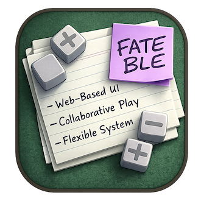
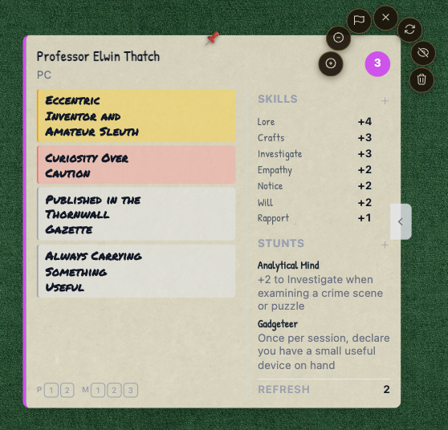
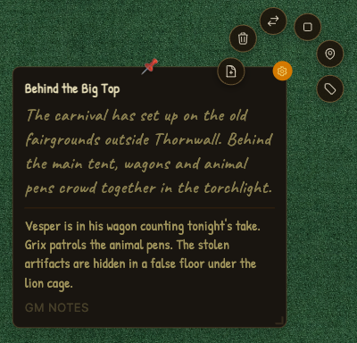
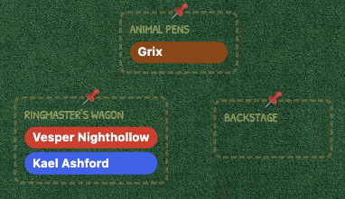
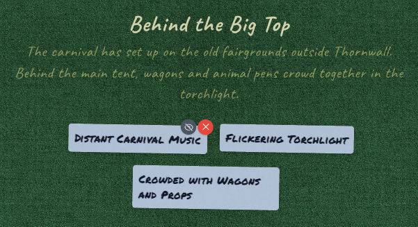
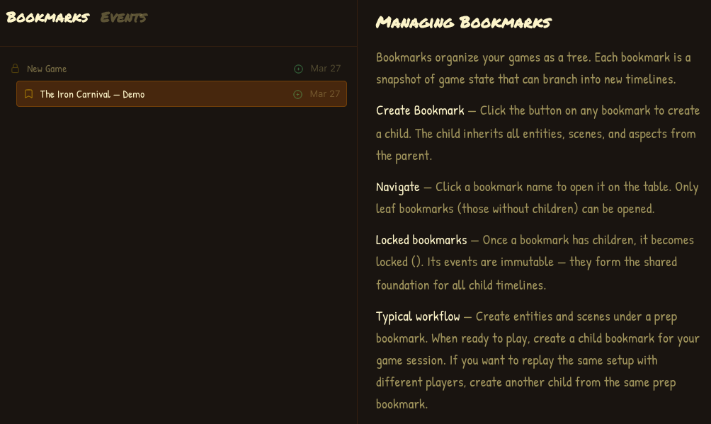
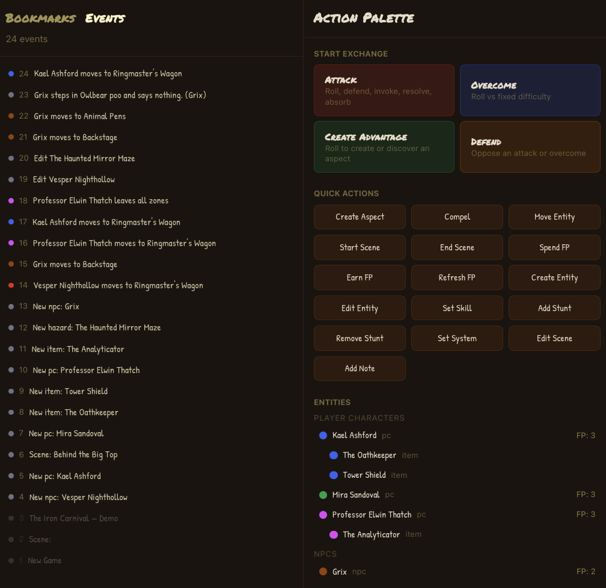
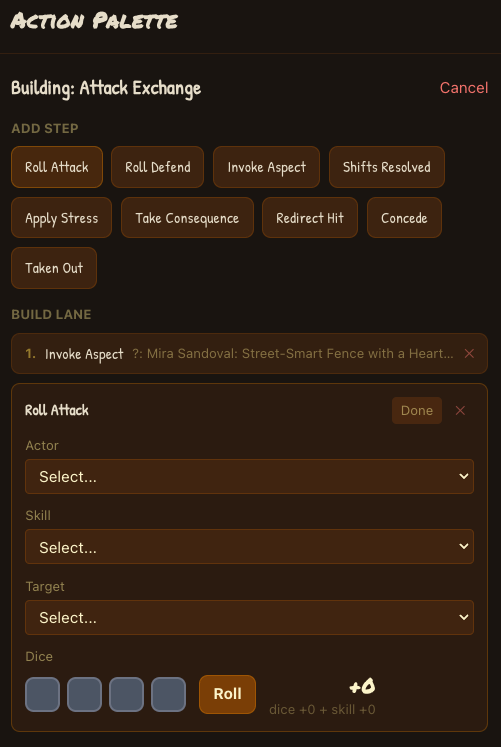

<p align="center">
  
</p>

# Fateble

A virtual tabletop for the [Fate RPG system](https://fate-srd.com/), built with Phoenix LiveView. The GM and players share a real-time table view with draggable entity cards, zone-based scenes, and a full conflict/exchange builder. An MCP server lets AI assistants prep and run games alongside the GM.

## Features

Every game action -- creating a character, rolling dice, taking stress -- is recorded as an event. The full game state is always derived from this event history, which means nothing is ever lost. **Bookmarks** are save points in this history: you can branch off from any bookmark to explore "what if" scenarios, then switch back to the original timeline whenever you like.

### Feature Matrix

> **Legend:** ✔ = implemented, dash = not yet implemented

| # | Feature | MCP (AI) | GM UI | Player UI |
|---|---------|:--------:|:-----:|:---------:|
| | **Campaign Setup** | | | |
| 1 | Set system (Core / Accelerated / custom skill list) | ✔ | ✔ | ✔ |
| 2 | Create entity with full sheet (aspects, skills, stunts, stress) | ✔ | ✔ | ✔ |
| 3 | Create entity (basic: name, kind, color, FP, refresh) | ✔ | ✔ | ✔ |
| 4 | Attach sub-entity to parent (weapons, items) | ✔ | ✔ | ✔ |
| 5 | Set / edit skills | ✔ | ✔ | ✔ |
| 6 | Add stunts | ✔ | ✔ | ✔ |
| 7 | Remove stunts | ✔ | ✔ | ✔ |
| 8 | Add aspects to entities / scenes / zones | ✔ | ✔ | ✔ |
| 9 | Remove aspects from entities | ✔ | ✔ | ✔ |
| 10 | Remove scene / zone aspects | ✔ | ✔ | ✔ |
| 11 | Create scene with zones + aspects + GM notes | ✔ | ✔ | ✔ |
| 12 | Add zones to an existing scene | ✔ | ✔ | ✔ |
| 13 | Edit scene name / description / GM notes | ✔ | ✔ | ✔ |
| | **Bookmarks & Branching** | | | |
| 14 | Create bookmark | ✔ | ✔ | -- |
| 15 | Fork from bookmark | ✔ | ✔ | -- |
| 16 | List bookmarks | ✔ | ✔ | ✔ |
| 17 | Archive bookmark | ✔ | ✔ | -- |
| 18 | Switch active bookmark (MCP) / navigate (UI) | ✔ | ✔ | ✔ |
| | **Running Scenes** | | | |
| 19 | Start a new scene | ✔ | ✔ | ✔ |
| 20 | End scene (clear stress, remove boosts) | ✔ | ✔ | ✔ |
| 21 | Switch between active scenes | -- | ✔ | ✔ |
| 22 | Move entity to zone | ✔ | ✔ | ✔ |
| 23 | Remove entity from zone | ✔ | ✔ | ✔ |
| 24 | Hide / reveal entity | ✔ | ✔ | -- |
| 25 | Hide / reveal zone | ✔ | ✔ | -- |
| 26 | Hide / reveal aspect | ✔ | ✔ | -- |
| | **Fate Point Economy** | | | |
| 27 | Spend fate point | ✔ | ✔ | ✔ |
| 28 | Earn fate point | ✔ | ✔ | ✔ |
| 29 | Refresh fate points | ✔ | ✔ | ✔ |
| 30 | Invoke aspect (free invoke) | ✔ | ✔ | ✔ |
| 31 | Invoke aspect (spend FP) | ✔ | ✔ | ✔ |
| 32 | Compel aspect | ✔ | ✔ | ✔ |
| | **Conflicts & Exchanges** | | | |
| 33 | Roll dice (attack / defend / overcome / create advantage) | -- | ✔ | ✔ |
| 34 | Resolve shifts | -- | ✔ | ✔ |
| 35 | Apply stress | ✔ | ✔ | ✔ |
| 36 | Take consequence | ✔ | ✔ | ✔ |
| 37 | Begin consequence recovery | ✔ | ✔ | ✔ |
| 38 | Clear recovered consequence | ✔ | ✔ | ✔ |
| 39 | Concede | ✔ | ✔ | ✔ |
| 40 | Taken out | ✔ | ✔ | ✔ |
| 41 | Eliminate mook | ✔ | ✔ | ✔ |
| 42 | Redirect hit | ✔ | ✔ | ✔ |
| 43 | Clear stress (outside scene end) | ✔ | ✔ | ✔ |
| | **Entity Management** | | | |
| 44 | Edit entity (name, kind, color, FP, refresh) | ✔ | ✔ | ✔ |
| 45 | Remove entity | ✔ | ✔ | ✔ |
| 46 | View entity detail | ✔ | ✔ | ✔ |
| | **Observation & History** | | | |
| 47 | View game state overview | ✔ | ✔ | ✔ |
| 48 | View event log | ✔ | ✔ | ✔ |
| 49 | Delete / undo event | ✔ | ✔ | -- |
| 50 | List scenes with detail | ✔ | ✔ | ✔ |
| | **Identity & Roles** | | | |
| 51 | Join with name and role (localStorage-based) | -- | ✔ | ✔ |
| 52 | Observer role (read-only view) | -- | -- | ✔ |

### User Interface

The app runs across two browser windows that stay in sync with each other and those of other players:

#### The Table

`/table/:bookmark_id` is the main play surface — a full-screen canvas with a felt-texture background where everything floats in a spring-physics layout. Entity cards, zones, scene aspects, and the GM notes card are all draggable elements that repel each other and settle into a readable arrangement.

**Entity cards** show name, kind, aspects, skills, stunts, stress boxes, consequences, and a fate point token. Cards are color-coded by entity and styled with hand-drawn fonts. Click the expand button to reveal the full character sheet. **Ring menus** appear on hover over the fate point token — buttons fan out in a viewport-aware arc for quick actions like +/- FP, concede, hide/reveal, and remove.



**The GM notes card** shows the current scene name, description, and private GM notes. Its ring menu provides scene management: start/end/switch scenes, add zones, and add situational aspects.



**Zones** are dashed-border regions on the table. Drag an entity's token into a zone to move them; drag out onto the table to leave. The GM can hide and reveal zones for players.



**Scene aspects** float as small cards near the scene title, styled by role — blue for situation aspects, yellow for boosts. The scene title and description are visible to all players.



The table also supports **pinning** (double-click to lock a card in place), **layout memory** (positions persist in localStorage per bookmark and scene), **warp animations** (entities and aspects fade in/out smoothly), and **selection sync** (click to select; selections sync across Table and Actions windows). **Participants** sit around the border of the table, with the GM on one edge and players distributed around the remaining sides.

#### The Actions Window

`/actions/:bookmark_id` opens in a second tab for the event log, bookmark tree, and action palette.

**Bookmarks** organize the game as a branching timeline. Each bookmark is a save point — fork from any bookmark to explore alternate scenarios, then switch back. Locked parent bookmarks form a shared foundation for all child timelines.



The left panel shows the **event log** — a complete history of game events, newest first. The GM can delete or reorder events by dragging. Invalid events (those referencing missing targets) are flagged with a warning icon. The right panel has the **action palette** with exchange starters, quick action buttons, and the entity list. Drag an entity onto any action button to pre-fill it.



The **exchange builder** handles multi-step conflicts. Start an Attack, Overcome, Create Advantage, or Defend exchange, then collaboratively build a sequence of steps — rolls, invokes, shifts, stress, consequences — in a shared build lane. Drag steps from the palette to reorder, or drag them out to remove. Click dice faces to cycle +/0/- manually, or hit Roll for random. When ready, commit all steps to the event log at once.



### Roles

On first visit, you choose a name and role. Your choice is stored in the browser and you rejoin automatically on return. No passwords -- this is designed for a trusted LAN.

**GM** -- Full visibility: hidden entities, hidden zones, hidden aspects, GM notes, full event history. Can delete/undo events, manage bookmarks, and access the MCP server. Multiple GMs are supported (e.g. a GM and an assistant).

**Player** -- Same gameplay actions as the GM: create entities, add aspects, roll dice, run conflicts. The only differences are visibility (no hidden items or GM notes) and administration (no event deletion or bookmark management).

**Observer** -- Read-only view of the public game state. Can watch the table and browse the event log but cannot take any actions. Layout memory still works so observers can arrange their view. Observers have no database record -- they exist only in the browser.

## Quick Start (Docker)

The fastest way to run Fateble with no Elixir or PostgreSQL installation required.

**Prerequisites:** [Docker Desktop](https://www.docker.com/products/docker-desktop/)

```bash
git clone https://github.com/robinhilliard/fateble
cd fate
docker compose up
```

Open [http://localhost:4000](http://localhost:4000). When you join for the first time, the app creates a demo scenario (The Iron Carnival) to get you started.

Database files are stored in `~/.fateble/pgdata` on your machine, so your data persists across restarts. To change the storage location, set `FATEBLE_DATA_DIR` before starting:

```bash
FATEBLE_DATA_DIR=/path/to/data docker compose up
```

To reset everything: `docker compose down` and delete `~/.fateble`.

## Getting Started (Development)

For contributors or anyone who wants to work on the code directly.

**Prerequisites:** Elixir 1.17+, PostgreSQL 16+

Start the dev database, then run the app:

```bash
docker compose -f docker-compose.dev.yml up -d   # Start PostgreSQL
mix setup                                          # Install deps, create DB, run migrations
mix phx.server                                     # Start at http://localhost:4000
```

When you join for the first time, the app creates a demo scenario (The Iron Carnival) to get you started.

**MCP endpoint:** `http://localhost:4000/api/mcp` (SSE transport, CORS enabled)

## Architecture

The app is built around an **event-sourced engine**: every game action is an immutable event. Events form a linked chain (each points to its parent) and the chain is replayed to produce the current `DerivedState`. **Bookmarks** point to a head event; forking a bookmark creates a new chain branch from that point. **Participants** are people at the table (GM + players) and entities can be controlled by a participant.

```
lib/
├── fate/
│   ├── engine.ex              # Event loading, state derivation, PubSub
│   ├── engine/
│   │   ├── replay.ex          # Pure event replay: events → derived state
│   │   └── state.ex           # Struct definitions for derived state
│   ├── game.ex                # Ash domain (Event, Bookmark, Participant)
│   ├── game/
│   │   ├── bookmarks.ex       # Bookmark lifecycle context
│   │   ├── demo.ex            # Demo scenario seed data
│   │   ├── bookmark.ex        # Ash resource
│   │   ├── bookmark_participant.ex
│   │   ├── event.ex           # Ash resource (37 event types)
│   │   ├── events.ex          # Event creation helpers
│   │   └── participant.ex
│   ├── mcp_server.ex          # MCP protocol handler for AI assistants
│   ├── release.ex             # Release tasks (migrations without Mix)
│   └── repo.ex                # Ecto/AshPostgres repo
├── fate_web/
│   ├── live/
│   │   ├── table_live.ex      # Main tabletop view
│   │   ├── actions_live.ex    # Action palette + exchange builder
│   │   ├── branches_live.ex   # Bookmark management
│   │   └── lobby_live.ex      # Role selection prompt + redirect
│   ├── components/
│   │   ├── table_components.ex # Entity cards, aspect cards, rings, modals
│   │   ├── core_components.ex  # Base Phoenix components
│   │   └── layouts.ex
│   └── helpers.ex             # Shared LiveView helpers
```

## Development

```bash
mix precommit          # Compile (warnings-as-errors) + format + test
mix test               # Run test suite
mix test --failed      # Re-run failures only
```

## Fate SRD Attribution

This work is based on Fate Core System and Fate Accelerated Edition (found at https://fate-srd.com/), products of Evil Hat Productions, LLC, developed, authored, and edited by Leonard Balsera, Brian Engard, Jeremy Keller, Ryan Macklin, Mike Olson, Clark Valentine, Amanda Valentine, Fred Hicks, and Rob Donoghue, and licensed for our use under the [Creative Commons Attribution 3.0 Unported](http://creativecommons.org/licenses/by/3.0/) license.
